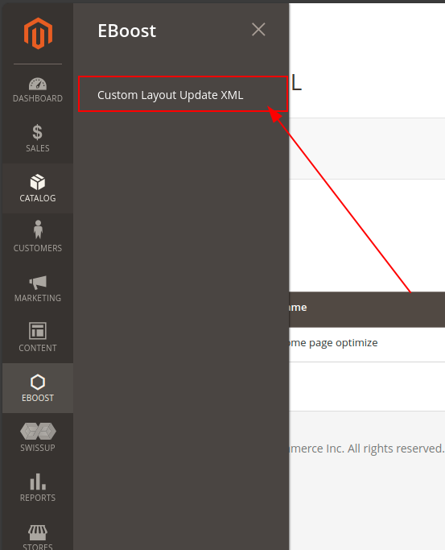
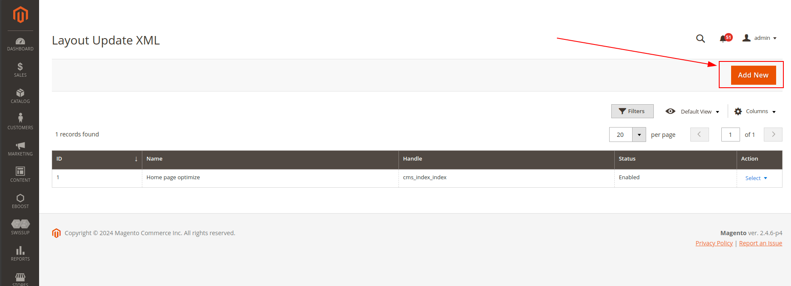
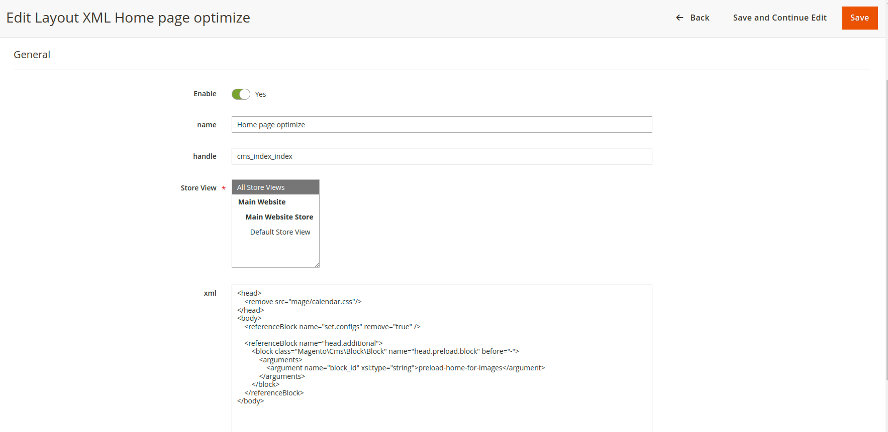
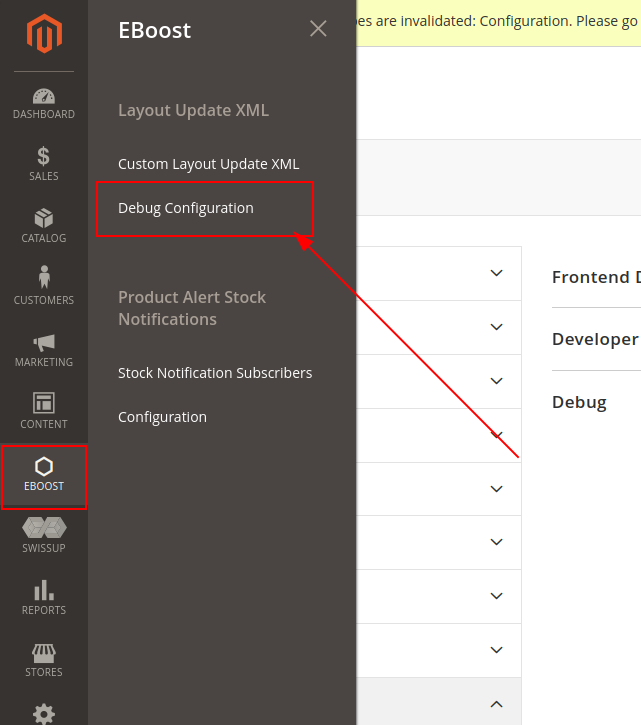
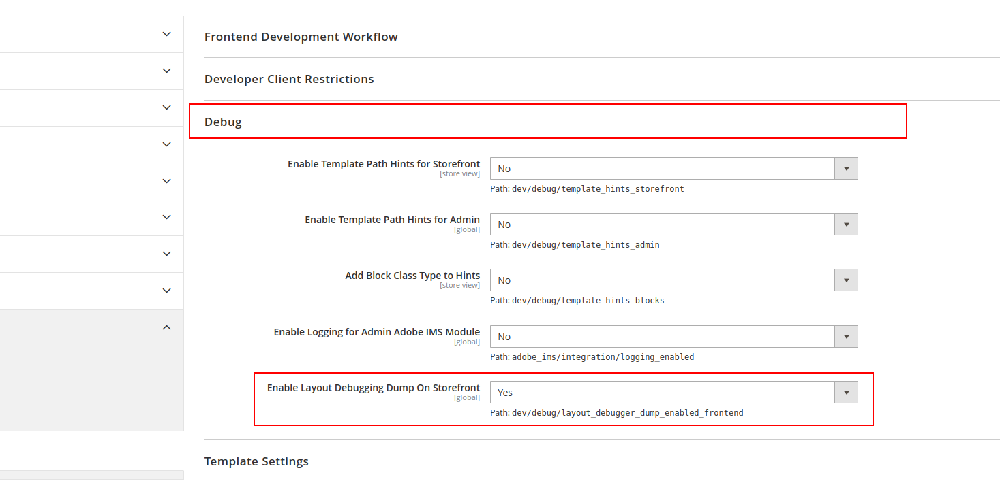
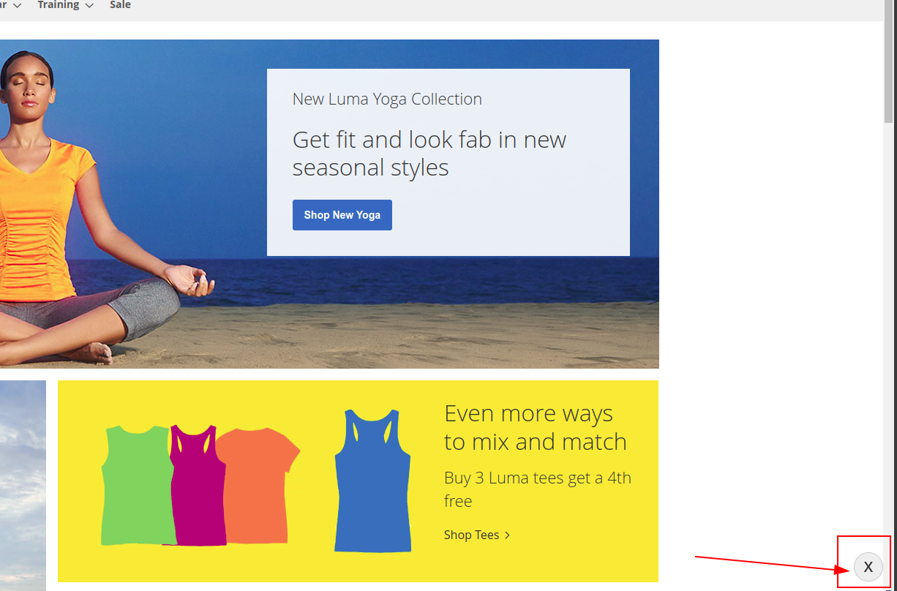
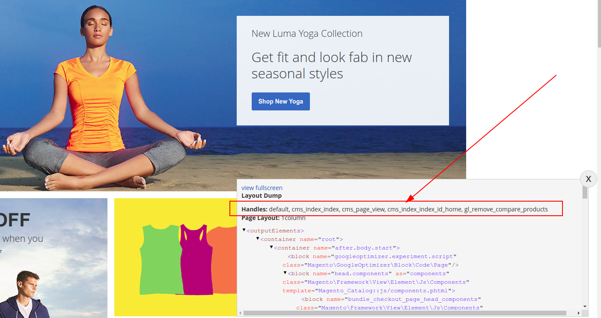

# EBoost - Custom layout Update XML (For developer)


This simple module adds a new layout update XML for a handler, allowing you to update layout XML directly in the backend without updating code. It allows you to add XML to update the layout of any pages that you would like based on the handler of the page. It will not affect other pages.

## Installation

Require the module

```bash
composer require eboosttech/magento2-layoutupdate
```

Enable the module

```bash
php bin/magento module:enable EBoost_LayoutUpdate
```

Run setup to install module and set up table(s)

```bash
php bin/magento setup:upgrade
```

## Usage

After the extension has been installed. Follow these steps: 

1. Go to `Eboost > Custom Layout Update XML` then click `Add new` button to create XML layout




2. Enter data for the form

***Note: If you don't know what is a handler. Please follow the document below to get it ***



3. Save and clear cache

4. Go to Frontend to see result

## How to see a handle of a page

***Note: it should be used on dev/staging servers. ***

1. Go to menu `Eboost > Debug Configuration` 



2. Open  `Debug` section

3. Change value of `Enable Layout Debugging Dump On Storefront` to `Yes`



4. Go to Frontend

5. Go to the page that you want to get the handle 

6. Click  `x` button on bottom right conner



7. All handles will be shown  in `Handles` section 





## Bugs/Feature Requests & Contribution

Please do open a pull request on GitHub should you want to contribute, or create an issue.

## License
[BSD-4-Clause](http://directory.fsf.org/wiki/License:BSD_4Clause) - Do as you wish 👍